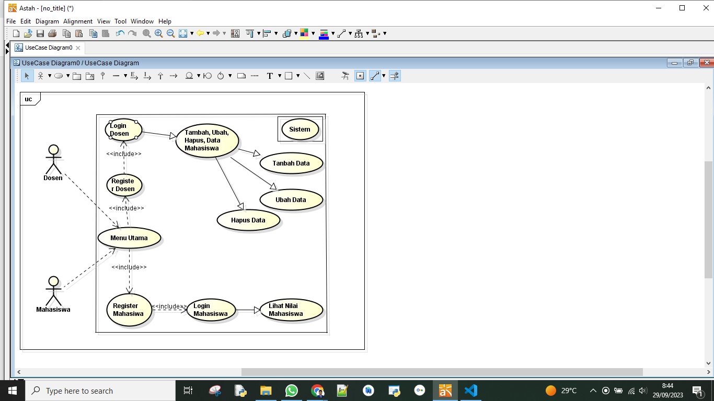
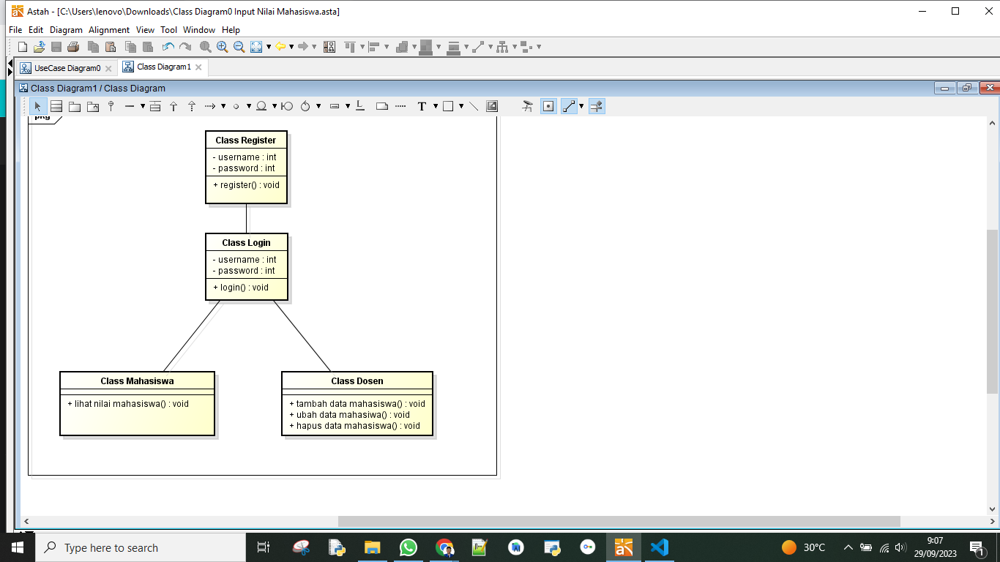
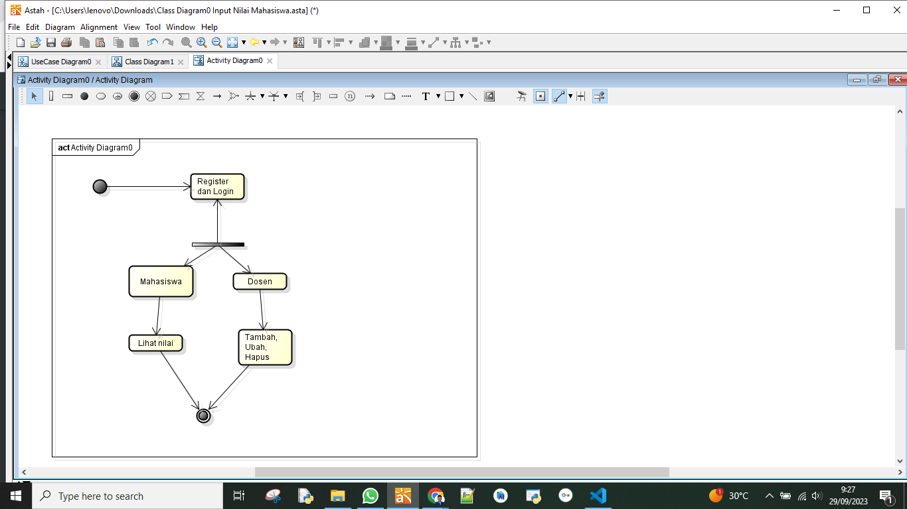
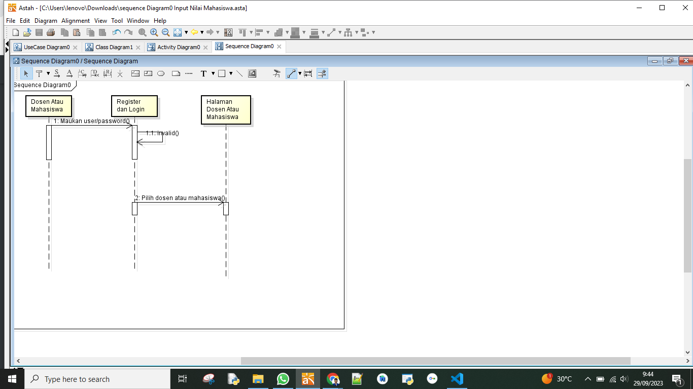
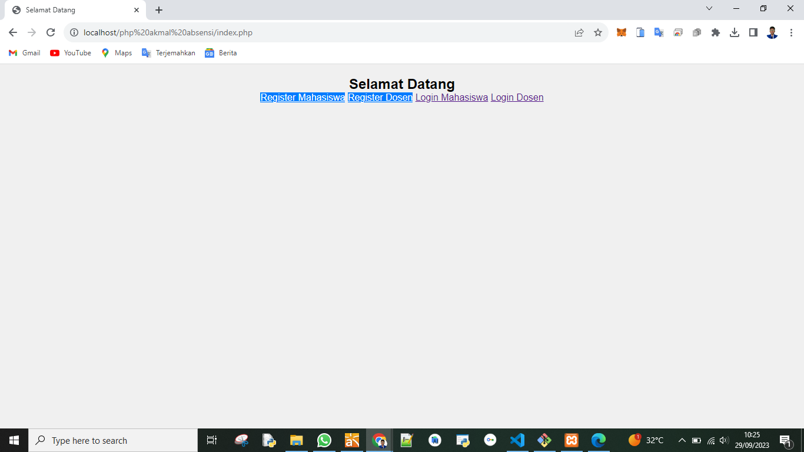
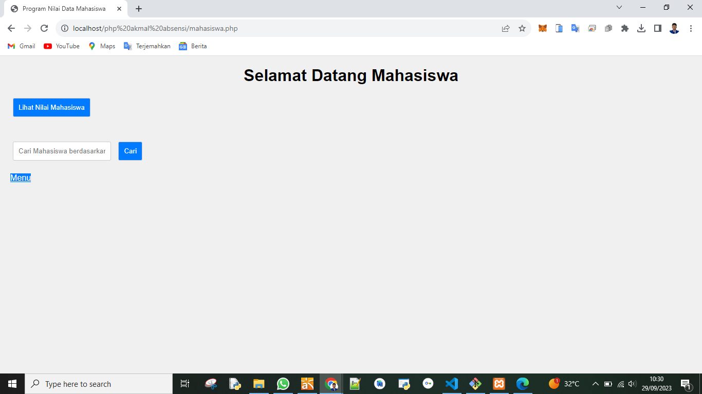
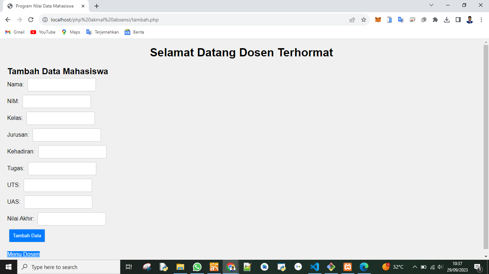
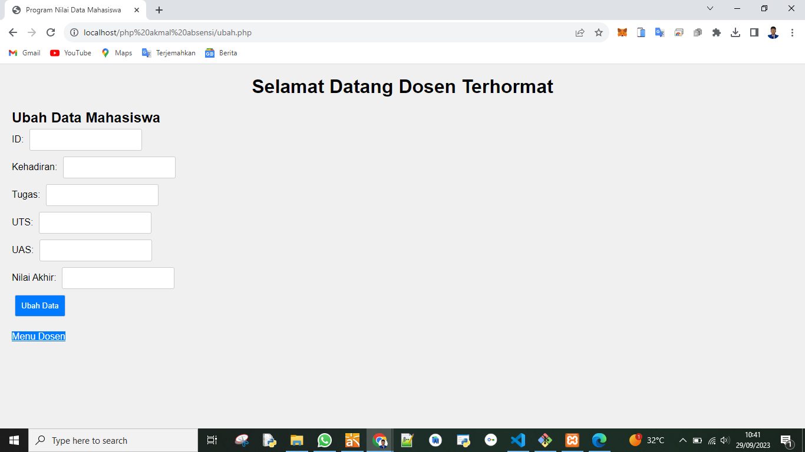
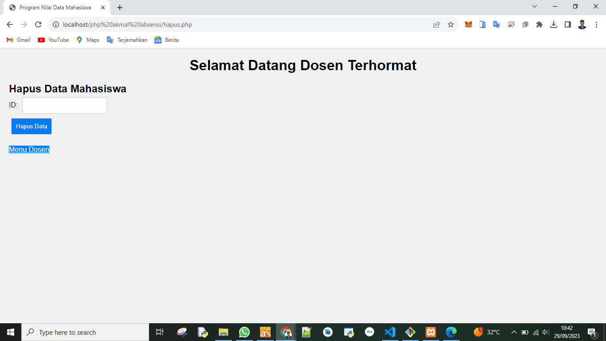

# Perancangan sistem informasi


## Profil
| #               | Biodata                      |
| --------------- | ---------------------------- |
| **Nama**        | M. AKMAL AL ABDILAH          |
| **NIM**         | 312110034                    |
| **Kelas**       | TI.21.A.1                    |
| **Mata Kuliah** | Perancangan Sistem Informasi |


<p align="center">
 
</p>
<p align="center">
<a href="https://github.com/akmalabdilah"></a>
<p align="center">

<hr>

## Aplikasi berbasis web input nilai dan liat nilai mahasiswa sederhana dengan menu login dan enkrip

<hr>


<p>
Disini saya akan menjelaskan secara singkat apa itu aplikasi input nilai dan liat nilai mahasiswa adalah aplikasi sederhana dimana dengan adanya aplikasi ini diharapkan para dosen dan mahasiwa bisa lebih mudah memberikan informasi dan menerima informasi nilai di aplikasi ini juga saya melengkapi dengan.

1. UseCase Diagram
2. Class Diagram
3. Activity Diagram
4. Sequence Diagram

dengan harapan bisa mudah untuk di mengerti dan suryukur bisa untuk di manfaatkan.
</p>


<hr>


## 4 gambar metode penjelasan

 

<hr>


<p>
1. Usecase Diagram
</p>



<p>
2. Class Diagram
</p>



<p>
3. Activity Diagram
</p>



<p>
4. Sequence Diagram
</p>




<hr>


## Penjelasan Menu Aplikasi

 

<hr>

<p>
Oke tampa basa basi lagi kita langsung saja melihat aplikasinya
</p>

<p>
1. Menu Utama
</p>



<p>
Dimenu utama ini menampilkan beberapa menu seperti menu registrasi dan login antara dosen dan mahasiwa, setelah kalian registrasi di salah tau menu mahasiswa atau dosen kalian hanya bisa login di menu login yang kalian registrasi.
</p>

<p>
Kalian bisa mencoba kode di bawah ini untuk menjajal menu seperti gambar di atas
</p>

```php
<!DOCTYPE html>
<html>
<head>
    <title>Selamat Datang</title>
    <link rel="stylesheet" type="text/css" href="style.css">
</head>
<body>
    <h2 align="center">Selamat Datang</h2>
    <div class="menu" align="center">
        <a href="register.php">Register Mahasiswa</a>
        <a href="register.php">Register Dosen</a>
        <a href="akmal.php">Login Mahasiswa</a>
        <a href="login.php">Login Dosen</a>
    </div>
</body>
</html>

```

<p>
2. Menu Mahasiswa.
</p>



<p>
Setelah kalian memilih menu login mahasiswa dan masuk ke halaman mahasiswa kalian akan di sugukan dengan dua menu, menu lihat nilai dan menu cari seperti gambar di atas. 
</p>

<p>
Kalian bisa menjajal kode di bawah ini jika kalian penasaran dengan menu di atas.
</p>


```php
<!DOCTYPE html>
<html>
<head>
    <title>Program Nilai Data Mahasiswa</title>
    <link rel="stylesheet" type="text/css" href="style.css">
</head>
<body>
    <h1>Selamat Datang Mahasiswa</h1>
    <form method="post">
        <input type="submit" name="lihat" value="Lihat Nilai Mahasiswa"><br><br>
    </form>
    
    <form method="post">
        <input type="text" name="nim_cari" placeholder="Cari Mahasiswa berdasarkan NIM">
        <input type="submit" name="cari" value="Cari">
    </form>


   

<?php
// Koneksi ke database MySQL
$servername = "localhost"; // Ganti dengan alamat server MySQL Anda
$username = "root"; // Ganti dengan username MySQL Anda
$password = ""; // Ganti dengan password MySQL Anda
$database = "akma_data_mahasiswa"; // Ganti dengan nama database Anda

$conn = mysqli_connect($servername, $username, $password, $database);

if (!$conn) {
    die("Koneksi gagal: " . mysqli_connect_error());
}


// Fungsi untuk melihat data mahasiswa dari database
function lihatMahasiswa()
{
    global $conn;
    $sql = "SELECT * FROM mahasiswa";
    $result = mysqli_query($conn, $sql);

    if (mysqli_num_rows($result) > 0) {
        while ($row = mysqli_fetch_assoc($result)) {
            echo "Nama: " . $row["nama"] . "<br>";
            echo "NIM: " . $row["nim"] . "<br>";
            echo "Kelas: " . $row["kelas"] . "<br>";
            echo "Jurusan: " . $row["jurusan"] . "<br>";
            echo "Kehadiran: " . $row["kehadiran"] . "<br>";
            echo "Tugas: " . $row["tugas"] . "<br>";
            echo "UTS: " . $row["uts"] . "<br>";
            echo "UAS: " . $row["uas"] . "<br>";
            echo "Nilai Akhir: " . $row["nilai_akhir"] . "<br>";
            echo "--------------------------<br>";
        }
    } else {
        echo "Tidak ada data mahasiswa.";
    }
}


// Fungsi untuk mencari data mahasiswa berdasarkan NIM
function cariMahasiswa($nim)
{
    global $conn;
    $sql = "SELECT * FROM mahasiswa WHERE nim = '$nim'";
    $result = mysqli_query($conn, $sql);

    if (mysqli_num_rows($result) > 0) {
        while ($row = mysqli_fetch_assoc($result)) {
            echo "Nama: " . $row["nama"] . "<br>";
            echo "NIM: " . $row["nim"] . "<br>";
            echo "Kelas: " . $row["kelas"] . "<br>";
            echo "Jurusan: " . $row["jurusan"] . "<br>";
            echo "Kehadiran: " . $row["kehadiran"] . "<br>";
            echo "Tugas: " . $row["tugas"] . "<br>";
            echo "UTS: " . $row["uts"] . "<br>";
            echo "UAS: " . $row["uas"] . "<br>";
            echo "Nilai Akhir: " . $row["nilai_akhir"] . "<br>";
            echo "--------------------------<br>";
        }
    } else {
        echo "Data mahasiswa dengan NIM $nim tidak ditemukan.";
    }
}

// Kode utama
if ($_SERVER["REQUEST_METHOD"] == "POST") {
    // Cek tindakan yang dilakukan
    if (isset($_POST["tambah"])) {
        $nama = $_POST["nama"];
        $nim = $_POST["nim"];
        $kelas = $_POST["kelas"];
        $jurusan = $_POST["jurusan"];
        $hadir = $_POST["hadir"];
        $tugas = $_POST["tugas"];
        $uts = $_POST["uts"];
        $uas = $_POST["uas"];
        $akhir = $_POST["akhir"];
        tambahMahasiswa($nama, $nim, $kelas, $jurusan, $hadir, $tugas, $uts, $uas, $akhir);
    } elseif (isset($_POST["lihat"])) {
        lihatMahasiswa();
    } elseif (isset($_POST["ubah"])) {
        $id = $_POST["id"];
        $hadir = $_POST["hadir"];
        $tugas = $_POST["tugas"];
        $uts = $_POST["uts"];
        $uas = $_POST["uas"];
        $akhir = $_POST["akhir"];
        ubahMahasiswa($id, $hadir, $tugas, $uts, $uas, $akhir);
    } elseif (isset($_POST["hapus"])) {
        $id = $_POST["id"];
        hapusMahasiswa($id);
    } elseif (isset($_POST["cari"])) {
        $nimCari = $_POST["nim_cari"];
        cariMahasiswa($nimCari);
    }
}
?>

<div class="menu">
        <a href="index.php">Menu</a>
    </div>
</body>
</html>

```


<p>
2. Menu Dosen.
</p>



```php
<?php
// Koneksi ke database MySQL
$servername = "localhost"; // Ganti dengan alamat server MySQL Anda
$username = "root"; // Ganti dengan username MySQL Anda
$password = ""; // Ganti dengan password MySQL Anda
$database = "akma_data_mahasiswa"; // Ganti dengan nama database Anda

$conn = mysqli_connect($servername, $username, $password, $database);

if (!$conn) {
    die("Koneksi gagal: " . mysqli_connect_error());
}

// Fungsi untuk menambahkan data mahasiswa ke database
function tambahMahasiswa($nama, $nim, $kelas, $jurusan, $hadir, $tugas, $uts, $uas, $akhir)
{
    global $conn;
    $sql = "INSERT INTO mahasiswa (nama, nim, kelas, jurusan, kehadiran, tugas, uts, uas, nilai_akhir) VALUES ('$nama', '$nim', '$kelas', '$jurusan', $hadir, $tugas, $uts, $uas, $akhir)";
    if (mysqli_query($conn, $sql)) {
        echo "Data mahasiswa berhasil ditambahkan.";
    } else {
        echo "Error: " . $sql . "<br>" . mysqli_error($conn);
    }
}


// Kode utama
if ($_SERVER["REQUEST_METHOD"] == "POST") {
    // Cek tindakan yang dilakukan
    if (isset($_POST["tambah"])) {
        $nama = $_POST["nama"];
        $nim = $_POST["nim"];
        $kelas = $_POST["kelas"];
        $jurusan = $_POST["jurusan"];
        $hadir = $_POST["hadir"];
        $tugas = $_POST["tugas"];
        $uts = $_POST["uts"];
        $uas = $_POST["uas"];
        $akhir = $_POST["akhir"];
        tambahMahasiswa($nama, $nim, $kelas, $jurusan, $hadir, $tugas, $uts, $uas, $akhir);
    } elseif (isset($_POST["lihat"])) {
        lihatMahasiswa();
    } elseif (isset($_POST["ubah"])) {
        $id = $_POST["id"];
        $hadir = $_POST["hadir"];
        $tugas = $_POST["tugas"];
        $uts = $_POST["uts"];
        $uas = $_POST["uas"];
        $akhir = $_POST["akhir"];
        ubahMahasiswa($id, $hadir, $tugas, $uts, $uas, $akhir);
    } elseif (isset($_POST["hapus"])) {
        $id = $_POST["id"];
        hapusMahasiswa($id);
    } elseif (isset($_POST["cari"])) {
        $nimCari = $_POST["nim_cari"];
        cariMahasiswa($nimCari);
    }
}
?>

<!DOCTYPE html>
<html>
<head>
    <title>Program Nilai Data Mahasiswa</title>
    <link rel="stylesheet" type="text/css" href="style.css">
</head>
<body>
    <h1>Selamat Datang Dosen Terhormat</h1>
    

    <h2>Tambah Data Mahasiswa</h2>
    <form method="post">
        Nama: <input type="text" name="nama"><br>
        NIM: <input type="text" name="nim"><br>
        Kelas: <input type="text" name="kelas"><br>
        Jurusan: <input type="text" name="jurusan"><br>
        Kehadiran: <input type="text" name="hadir"><br>
        Tugas: <input type="text" name="tugas"><br>
        UTS: <input type="text" name="uts"><br>
        UAS: <input type="text" name="uas"><br>
        Nilai Akhir: <input type="text" name="akhir"><br>
        <input type="submit" name="tambah" value="Tambah Data">
    </form>

    

    <div class="menu">
        <a href="admin.php">Menu Dosen </a>
    </div>
</body>
</html>


```



```php
<?php
// Koneksi ke database MySQL
$servername = "localhost"; // Ganti dengan alamat server MySQL Anda
$username = "root"; // Ganti dengan username MySQL Anda
$password = ""; // Ganti dengan password MySQL Anda
$database = "akma_data_mahasiswa"; // Ganti dengan nama database Anda

$conn = mysqli_connect($servername, $username, $password, $database);

if (!$conn) {
    die("Koneksi gagal: " . mysqli_connect_error());
}

// Fungsi untuk mengubah data mahasiswa di database
function ubahMahasiswa($id, $hadir, $tugas, $uts, $uas, $akhir)
{
    global $conn;
    $sql = "UPDATE mahasiswa SET kehadiran = $hadir, tugas = $tugas, uts = $uts, uas = $uas, nilai_akhir = $akhir WHERE id = $id";
    if (mysqli_query($conn, $sql)) {
        echo "Data mahasiswa berhasil diubah.";
    } else {
        echo "Error: " . $sql . "<br>" . mysqli_error($conn);
    }
}


// Kode utama
if ($_SERVER["REQUEST_METHOD"] == "POST") {
    // Cek tindakan yang dilakukan
    if (isset($_POST["tambah"])) {
        $nama = $_POST["nama"];
        $nim = $_POST["nim"];
        $kelas = $_POST["kelas"];
        $jurusan = $_POST["jurusan"];
        $hadir = $_POST["hadir"];
        $tugas = $_POST["tugas"];
        $uts = $_POST["uts"];
        $uas = $_POST["uas"];
        $akhir = $_POST["akhir"];
        tambahMahasiswa($nama, $nim, $kelas, $jurusan, $hadir, $tugas, $uts, $uas, $akhir);
    } elseif (isset($_POST["lihat"])) {
        lihatMahasiswa();
    } elseif (isset($_POST["ubah"])) {
        $id = $_POST["id"];
        $hadir = $_POST["hadir"];
        $tugas = $_POST["tugas"];
        $uts = $_POST["uts"];
        $uas = $_POST["uas"];
        $akhir = $_POST["akhir"];
        ubahMahasiswa($id, $hadir, $tugas, $uts, $uas, $akhir);
    } elseif (isset($_POST["hapus"])) {
        $id = $_POST["id"];
        hapusMahasiswa($id);
    } elseif (isset($_POST["cari"])) {
        $nimCari = $_POST["nim_cari"];
        cariMahasiswa($nimCari);
    }
}
?>

<!DOCTYPE html>
<html>
<head>
    <title>Program Nilai Data Mahasiswa</title>
    <link rel="stylesheet" type="text/css" href="style.css">
</head>
<body>
    <h1>Selamat Datang Dosen Terhormat</h1>

    <h2>Ubah Data Mahasiswa</h2>
    <form method="post">
        ID: <input type="text" name="id"><br>
        Kehadiran: <input type="text" name="hadir"><br>
        Tugas: <input type="text" name="tugas"><br>
        UTS: <input type="text" name="uts"><br>
        UAS: <input type="text" name="uas"><br>
        Nilai Akhir: <input type="text" name="akhir"><br>
        <input type="submit" name="ubah" value="Ubah Data">
    </form>

   
    <div class="menu">
        <a href="admin.php">Menu Dosen</a>
    </div>
</body>
</html>

```



```php
<?php
// Koneksi ke database MySQL
$servername = "localhost"; // Ganti dengan alamat server MySQL Anda
$username = "root"; // Ganti dengan username MySQL Anda
$password = ""; // Ganti dengan password MySQL Anda
$database = "akma_data_mahasiswa"; // Ganti dengan nama database Anda

$conn = mysqli_connect($servername, $username, $password, $database);

if (!$conn) {
    die("Koneksi gagal: " . mysqli_connect_error());
}

// Fungsi untuk menghapus data mahasiswa dari database
function hapusMahasiswa($id)
{
    global $conn;
    $sql = "DELETE FROM mahasiswa WHERE id = $id";
    if (mysqli_query($conn, $sql)) {
        echo "Data mahasiswa berhasil dihapus.";
    } else {
        echo "Error: " . $sql . "<br>" . mysqli_error($conn);
    }
}


// Kode utama
if ($_SERVER["REQUEST_METHOD"] == "POST") {
    // Cek tindakan yang dilakukan
    if (isset($_POST["tambah"])) {
        $nama = $_POST["nama"];
        $nim = $_POST["nim"];
        $kelas = $_POST["kelas"];
        $jurusan = $_POST["jurusan"];
        $hadir = $_POST["hadir"];
        $tugas = $_POST["tugas"];
        $uts = $_POST["uts"];
        $uas = $_POST["uas"];
        $akhir = $_POST["akhir"];
        tambahMahasiswa($nama, $nim, $kelas, $jurusan, $hadir, $tugas, $uts, $uas, $akhir);
    } elseif (isset($_POST["lihat"])) {
        lihatMahasiswa();
    } elseif (isset($_POST["ubah"])) {
        $id = $_POST["id"];
        $hadir = $_POST["hadir"];
        $tugas = $_POST["tugas"];
        $uts = $_POST["uts"];
        $uas = $_POST["uas"];
        $akhir = $_POST["akhir"];
        ubahMahasiswa($id, $hadir, $tugas, $uts, $uas, $akhir);
    } elseif (isset($_POST["hapus"])) {
        $id = $_POST["id"];
        hapusMahasiswa($id);
    } elseif (isset($_POST["cari"])) {
        $nimCari = $_POST["nim_cari"];
        cariMahasiswa($nimCari);
    }
}
?>

<!DOCTYPE html>
<html>
<head>
    <title>Program Nilai Data Mahasiswa</title>
    <link rel="stylesheet" type="text/css" href="style.css">
</head>
<body>
    <h1>Selamat Datang Dosen Terhormat</h1>
    
    <h2>Hapus Data Mahasiswa</h2>
    <form method="post">
        ID: <input type="text" name="id"><br>
        <input type="submit" name="hapus" value="Hapus Data">
    </form>

    <div class="menu">
        <a href="admin.php">Menu Dosen</a>
    </div>
</body>
</html>
```


<p>
Setelah kalian memilih menu login Dosen dan masuk ke halaman dosen kalian akan di sugukan dengan tiga menu, menu tambah, ubah, dan hapus  seperti gambar di atas. 
</p>


<P>
Oke sekian penjelasan singkat saya mengenai aplikasi yang saya buat  kali ini jika kalian masih penasara kalian bisa mencoba file lengkap php code yang ada di atas lengkap dengan database.sql kurang lebih saya mohon maaf.
</P>

<p>
 sekian and selesai.
</p>

<div>
<h2 align="center">Thanks For Reading!!!</h2>
<div align="center">
